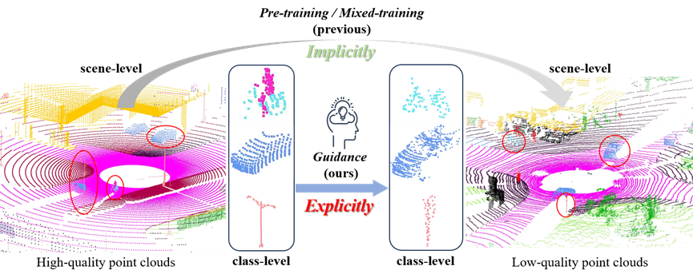

# SimPCSS

<h2> 
<a href="https://github.com/WHU-USI3DV/SimPCSS" target="_blank">Simulated Point Clouds Explicitly Guided Semantic Segmentation</a>
</h2>

This is the PyTorch implementation about point cloud semantic segmentation of the following publication:

> **Simulated Point Clouds Explicitly Guided Semantic Segmentation**<br/>
> [Zhe Chen](https://chenzhe-code.github.io/), [Jiahao Zhou](https://ddakun.github.io/), [Chen Long](https://chenlongwhu.github.io/), [Peiling Tong](https://3s.whu.edu.cn/info/1028/1961.htm), [Pangyin Li](https://3s.whu.edu.cn/info/1028/2062.htm), [Fuxun Liang](https://liangfxwhu.github.io/), [Zhen Dong](https://dongzhenwhu.github.io/index.html) <br/>
> [**Paper**](https://github.com/WHU-USI3DV/SimPCSS)  *PE&RS 2025*<br/>


## 🔭 Introduction
<p align="center">
<strong>Simulated Point Clouds Explicitly Guided Semantic Segmentation</strong>
</p>
<div align=center>

</div>

<p align="justify">
<strong>Abstract:</strong>
Point cloud semantic segmentation (PCSS) is crucial for smart city management but remains a challenging task due to the irregular and sparse nature of the data. While recent advancements in PCSS focus on improving network architectures, less attention has been given to the data aspect. In image analysis, synthetic data has proven useful, but generating point clouds that match real-world distributions remains difficult. In contrast, it is accessible to obtain unlimited high-density, noise-free point clouds through simulators. To enhance PCSS from the data aspect, we propose Simulated Point Clouds Explicitly Guided Semantic Segmentation (SimPCSS), a plug-and-play supervised learning scheme. Specially, we generate labeled point clouds in various scenarios using an autonomous driving simulator and train a segmentation model. Then, multi-scale features with high confidence are then extracted to construct prior guidance through the Confidence Update Strategy (CUS). We further introduce an Imitation Learning Strategy (ILS), which injects the above prior guidance into the segmentation process of low-quality point clouds, improving performance. The proposed method is model-agnostic, requiring only minor adjustments to existing network architectures. Experiments conducted on both synthetic and real-world datasets with various models (MinkUnet & PTv3) demonstrate that SimPCSS effectively leverages high-quality point clouds to improve the segmentation of low-quality point clouds.
</p>

## 🆕 News
- 2025-10-10:  Accepted by PE&RS! 🎉🎉🎉
- 2023-10-5: Code is aviliable! 🎉


### 💻 Requirements
The code has been tested on:
- Ubuntu 20.04
- CUDA 11.6
- Python 3.8.0
- Pytorch 1.13.1
- GeForce RTX 4090.

### 🔧 Installation
You can create an environment directy using the provided ```environment.yaml```
```
conda env create -f environment.yaml
conda activate pcda
```

### 💾 Dataset 
Our method has been experimented in both the  simulated and real-world datasets.


- HQSLiDAR
  - The HQSLiDAR dataset (32/64/128 channel) can be downloaded via [Google Drive](https://drive.google.com/file/d/1Cg62MEEIoYsMgi3gbyYBaV_09JL92izN/view?usp=drive_link)
  - the data is organized as follows:
    ```bash
    # HQSLiDAR dir: the directory of HQSLiDAR dataset.
    # |- HQSLiDAR_DIR
    #   |- 2kitti.yaml # The mapping file that maps categories to the SemanticKITTI classes.
    #   |- sem_lidar32
    #     |- 00
    #       |- velodyne
    #         |- 00000.bin
    #         |- 00001.bin
    #         |- ...
    #       |- labels
    #         |- 00000.label
    #         |- 00001.label
    #         |- ...
    #     |- 01
    #     |- ...
    #   |- sem_lidar64
    #   |- sem_lidar128
    ```

- SemanticKITTI
  - Download [SemanticKITTI](https://www.semantic-kitti.org/dataset.html#download) dataset.
  - the data is organized as follows:
    ```bash
    # SEMANTIC_KITTI_DIR: the directory of SemanticKITTI dataset.
    # |- SEMANTIC_KITTI_DIR
    #   |- dataset
    #     |- sequences
    #       |- 00
    #       |- 01
    #       |- ...
    ```

- nuScenes
  - Download the official [NuScene](https://www.nuscenes.org/nuscenes#download) dataset (with Lidar Segmentation) and organize the downloaded files as follows:
    ```bash
    # NUSCENES_DIR
    # │── samples
    # │── sweeps
    # │── lidarseg
    # ...
    # │── v1.0-trainval 
    # │── v1.0-test
    ```
    
  - Run preprocessing code for ArkitScenes as follows:
    ```bash
    # RAW_AS_DIR: the directory of downloaded ArkitScenes dataset.
    # PROCESSED_AS_DIR: the directory of processed ArkitScenes dataset (output dir).
    # NUM_WORKERS: Number for workers for preprocessing, default same as cpu count (might OOM).
    cd $POINTCEPT_DIR
    export PYTHONPATH=./
    python pointcept/datasets/preprocessing/arkitscenes/preprocess_arkitscenes_mesh.py --dataset_root $RAW_AS_DIR --output_root $PROCESSED_AS_DIR --num_workers $NUM_WORKERS
    ```


Once the datasets are downloaded and organized, change the *dataset_path* in the related config file according to the actual path for training and testing purposes.

### 🔦 Train

We first train a model on a high-quality simulated dataset, which is then used to initialize high-quality class prototypes.
```
python train_source.py -cfg source/MspcLiDAR.yaml

python prototype_dist_init.py -cfg adaptation/MspcLiDAR_HB2SK.yaml
```

Then, we conduct the imitation learning using both the HQSliDAR and the low-quality point clouds.
```
# update prototype
python train_SD.py -cfg adaptation/MspcLiDAR_HB2SK.yaml

# freeze prototype
python train_SD_Proto.py -cfg adaptation/MspcLiDAR_HB2SK.yaml 
```

### ✏️ Test

```
# Test the performance of network with LQ2HQ learner.
python test_SD.py -cfg adaptation/MspcLiDAR_HB2SK.yaml

# Test the performance of network without LQ2HQ learner.
python test.py -cfg adaptation/MspcLiDAR_HB2SK.yaml
```

## 💡 Citation
If you find this repo helpful, please give us a 😍 star 😍.
Please consider citing our works if this program benefits your project.
```
```
